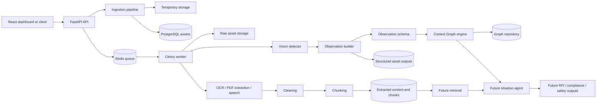

# Construction RFI Copilot: System Overview

## Abstract

Construction RFI Copilot is a multimodal construction-safety and project-context platform. It accepts project evidence such as images and PDF documents, stores each source as a traceable asset, processes that asset asynchronously, and converts its contents into structured observations and searchable text units. Vision processing identifies workers, personal protective equipment, and heavy equipment, then derives factual spatial relationships such as proximity. OCR, document extraction, and speech transcription provide textual evidence from visual, document, and audio sources. A session-scoped Context Graph is intended to combine these observations into a canonical model of the investigation, preserving confidence and source provenance. A future retrieval and agent layer can use that model together with regulations, specifications, and historical project material to produce evidence-backed RFIs, compliance findings, safety summaries, and recommendations.

The system is organized around a separation of concerns: perception extracts facts, the graph consolidates facts, retrieval supplies external or project knowledge, and an agent interprets the combined context. This keeps the detection layer from making policy judgments and makes downstream conclusions traceable to the assets and observations that support them.

## System Purpose

The platform addresses a construction investigation workflow in which information is distributed across photographs, drawings or reports, recorded statements, and project documentation. Its primary responsibilities are:

- ingest and de-duplicate source files;
- process multimodal evidence in background workers;
- preserve original assets and derived outputs;
- extract text and divide it into content chunks for later retrieval;
- transform computer-vision results into factual scene observations;
- combine observations into a session-level context graph;
- expose graph and processing state through APIs;
- provide a frontend view of detected entities, PPE state, equipment, and spatial facts.

## Architectural Model

The system has six logical layers.

### 1. Client and presentation layer

The React frontend presents the current observation model as a visual dashboard. It renders entity bounding boxes, worker PPE indicators, machinery, and proximity edges, and exposes a mock-data mode for development. Its live mode is designed to fetch asset observations from the FastAPI service, although that asset-observation endpoint is not currently implemented.

### 2. API and orchestration layer

FastAPI is the public application boundary. It provides:

- `POST /upload` for file ingestion and processing-job submission;
- `GET /health` for service health;
- `POST /context/sessions` to create a graph session;
- `GET /context/sessions/{session_id}/graph` to read the canonical graph;
- `POST /context/observations` to merge a normalized observation into a graph;
- `GET /job/{job_id}` as a current placeholder for job status.

The upload route does not execute expensive machine-learning work inline. It validates and stores the asset, creates its database record, builds a typed worker payload, and submits the Celery task through Redis.

### 3. Ingestion and asset storage layer

The ingestion pipeline writes an uploaded file to a temporary location, detects its MIME type, accepts supported images and PDFs, computes a SHA-256 hash, and derives a content-addressed final path under `storage/raw/images` or `storage/raw/pdfs`. The API then creates an `Asset` record containing the original filename, hash, stored path, content type, status, and creation time.

The hash serves two purposes: it makes storage paths deterministic and allows the database uniqueness constraint to reject duplicate content. Temporary files are removed after a successful move, duplicate upload, or failed request.

### 4. Asynchronous processing layer

Celery workers use Redis as both broker and result backend. The worker loads the asset from PostgreSQL, changes its status from `PENDING` to `PROCESSING`, selects a processing branch by MIME type, persists derived outputs, and finally marks the asset `READY`. Processing failures roll back the active transaction, mark the asset `FAILED`, and allow Celery to retry the task up to three times.

The current processing branches are:

- **Image:** OCR text extraction, object detection, conversion of detection geometry into a factual observation payload, and persistence of that payload as an `AssetOutput` of type `vision_geometry`.
- **PDF:** text extraction followed by cleaning and chunking.
- **Audio:** speech transcription followed by cleaning and chunking when an audio asset reaches the worker. The current ingestion API does not accept audio yet, so this branch is prepared for a later ingestion extension.

### 5. Derived knowledge layer

Text-producing branches normalize extracted text by removing control characters, normalizing spaces and newlines, repairing hyphenated line breaks, and normalizing paragraph spacing. The cleaned text is stored in `ExtractedContent` with extraction metadata such as pages, language, segments, source, and cleaning steps.

The chunking stage converts extracted material into ordered `ContentChunk` records. Each chunk retains its parent asset, its extracted-content record, index, type, text, and optional metadata. These chunks are the intended unit for future retrieval and grounding of agent responses.

Vision output is stored separately in `AssetOutput` as structured JSON. This preserves geometry and relationships without forcing visual facts into a text-only representation.

### 6. Context, retrieval, and reasoning layer

The Context Graph is the canonical world model for one investigation session. It is not itself a reasoning engine. It stores typed nodes such as workers, PPE, equipment, locations, documents, issues, regulations, and inspections, together with typed relationships such as `WEARING`, `NEAR`, `LOCATED_AT`, `REFERENCES`, and `SUPPORTS`.

The graph API accepts a universal `Observation` contract. An observation identifies its session, source asset, observation type, source type, timestamp, transient nodes, and transient edges. The `ContextGraphEngine` resolves each transient node against existing graph state, creates canonical UUIDs for new entities, merges repeat observations, appends provenance history, updates graph version metadata, and persists the result through a repository abstraction.

The repository currently uses in-memory storage. A PostgreSQL-backed graph repository is the intended next step so sessions survive process restarts and can be queried alongside assets and derived content.

The retrieval and agent packages are currently placeholders. Their intended relationship to the implemented layers is:

1. retrieval selects relevant `ContentChunk` records and other project knowledge for a question or investigation;
2. the context engine supplies the current structured situation graph;
3. the agent combines graph facts with retrieved evidence and applies project or regulatory reasoning;
4. generated outputs are returned as human-readable findings or persisted as structured asset or investigation outputs.

## End-to-End Feature Flow

In operational sequence:

1. A user uploads evidence through the API.
2. Ingestion detects the type, hashes the file, and stages it in durable storage.
3. PostgreSQL records the asset as `PENDING`.
4. Redis queues a Celery task containing the asset identity and processing metadata.
5. The worker reads the asset and sets it to `PROCESSING`.
6. The appropriate extractor and/or detector runs.
7. Text is cleaned, stored, and chunked; image detections are converted into structured visual output.
8. The asset becomes `READY`, or `FAILED` after an unrecoverable processing error.
9. A normalized observation can be submitted to a session graph.
10. The graph resolves entities, merges relationships, and records provenance.
11. Future retrieval and agent services use the chunks and graph together to create grounded construction intelligence.

## Core Data Contracts

### Asset

An `Asset` is the durable identity of an uploaded source. It links the source filename and content type to its hash, storage path, and processing lifecycle. The lifecycle is `PENDING -> PROCESSING -> READY` or `FAILED`.

### Extracted content and chunks

`ExtractedContent` holds the cleaned text and extraction metadata. `ContentChunk` holds ordered, retrieval-sized portions of that text. Both retain an `asset_id`, allowing every later answer to be traced to its original evidence.

### Vision asset output

`AssetOutput` stores structured derived results. The current `vision_geometry` payload contains workers, PPE associations, heavy equipment, and worker-to-machinery proximity facts. The observation builder deliberately reports facts and distances; it does not decide whether a situation is compliant or unsafe.

### Observation

`Observation` is the multimodal normalization boundary. Vision, OCR, speech, and document processing can all map into the same node-and-edge shape. Each observation retains source identity, source type, observation type, confidence, and timestamp.

### Context graph

`ContextGraph` is a session-level canonical model. Nodes represent entities and concepts; edges represent relationships; provenance histories preserve the supporting source asset, observation identifier, confidence, and timestamp. This makes repeated observations mergeable while retaining an audit trail.

## Deployment Topology

The Compose environment currently defines:

- **PostgreSQL 15:** asset, extraction, chunk, and output persistence;
- **Redis 7:** Celery messaging and task backend;
- **MinIO:** object-storage infrastructure reserved for scalable asset storage;
- **API container:** FastAPI gateway and frontend static-file serving;
- **Worker container:** Celery processing and model execution.

The API and worker share the storage volume and use the same PostgreSQL and Redis services. ML model weights are mounted through a worker model-cache volume. Alembic manages database migrations.

## Reliability and Traceability

The system already provides several reliability mechanisms:

- SHA-256 de-duplication prevents the same content from being registered twice.
- Database status fields expose processing lifecycle state.
- Celery retries transient worker failures.
- Database rollback prevents partial extraction writes from being treated as complete.
- Correlation IDs are carried in worker input and logs.
- Extraction metadata records how text was produced and cleaned.
- Observation and graph provenance connects derived facts back to source assets.

The main current limitations are that the job-status endpoint is mocked, graph state is memory-only, MinIO is provisioned but not used by the ingestion implementation, and the retrieval and agent layers are not implemented. The frontend's live observation route also needs to be added or aligned with the existing graph and asset-output APIs.

## Intended Product Outcome

Once the remaining layers are connected, the system will support an investigation loop: collect project evidence, build a structured representation of the observed construction scene, retrieve the governing project and regulatory context, identify conflicts or risks, and produce an RFI or compliance-oriented response with links back to the evidence and graph facts that support it. The architecture is designed so new modalities and detectors can be added at the observation boundary without rewriting the graph or reasoning layers.